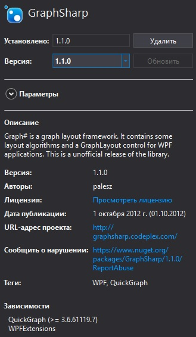

# VKFrendsGraph

Строит граф друзей пользователей ВК

## Применение 

Делалась как лабораторная работа... подойдет для сдачи в вашем више

Если функции VK API заблокированы нужно использовать VPN

## Сделано с использованием 

- VK API
- 

 ## Пример
 
 - получите список друзей пользователя введя его id:
 
 
 
 
 
 - постройте граф используя один из алгоритмов их построения:
 
  
